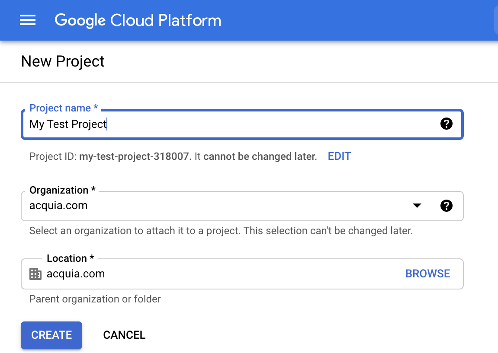
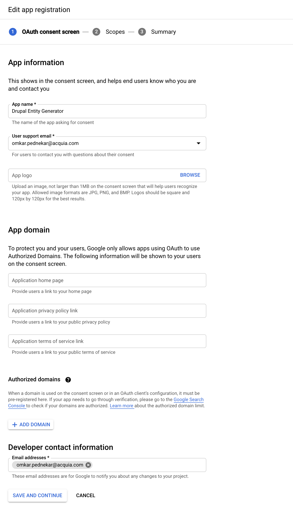
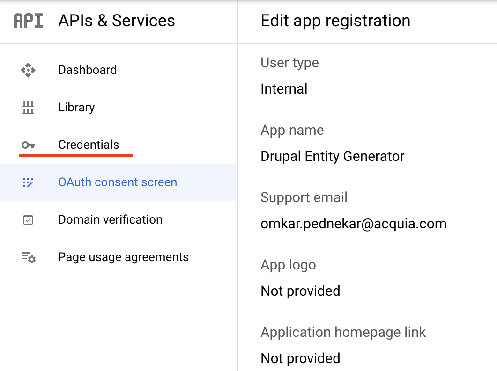
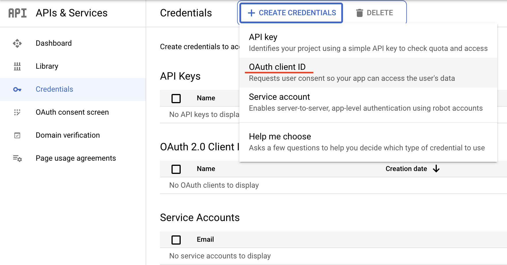
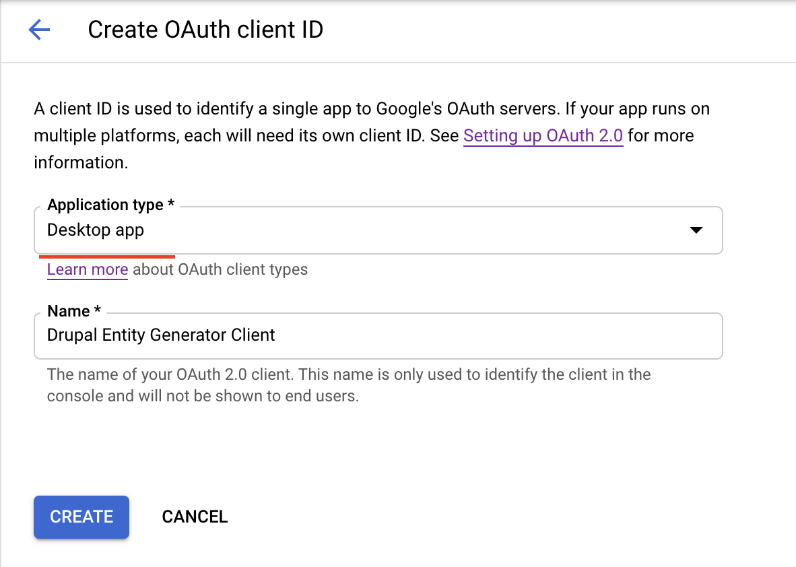
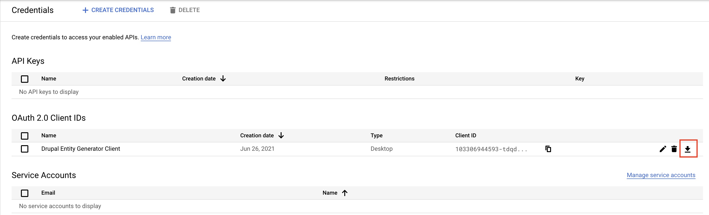
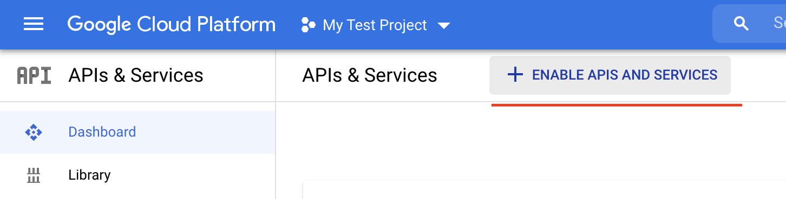

.. _installation:

Installation
===============================
Using composer is the preferred way of managing your modules and themes as composer handles dependencies automatically and there is less margin for error. You can find out more about composer and how to install it here: https://getcomposer.org/. It is not recommended to edit your composer.json file manually.

Download using composer
-----------------------
Add Github repository source in you project composer.json. Add below is snippet under ``repositories`` in composer.json:
::

    "acquia-pso": {
      "url": "https://github.com/acquia-pso/dst-entity-generate.git",
      "type": "git"
    }

More information on adding repository can found at `Modifying Repositories <https://getcomposer.org/doc/03-cli.md#modifying-repositories>`_

Open up your terminal and navigate to your project root directory.
Run the following command  to require the module:
::

    composer require acquia-pso/dst-entity-generate

DST Entity Generate module will install along with several module dependencies from drupal.org.

.. Important::

   * In installation, you may need to provide a token.
   * You need to create a token in your github account.

You can now enable the modules via drush with the following commands:
::

    drush pm:enable dst_entity_generate -y

Create a Google spreadsheet for defining all drupal entities like  `DEG sample template <https://docs.google.com/spreadsheets/d/1xJFEeIqTAC-Au02PEwPVS1zLLnwhsYaqqYPsbF8fv30>`_

Obtaining Google OAuth 2.0 Client Credentials
---------------------------------------------
* **Go to Google Cloud Platform and** `create new project <https://console.cloud.google.com/projectcreate>`_

* **After project creation, make sure your created project is selected.**

.. image:: images/select_project.png
  :width: 400

* **Then navigate to OAuth consent screen.**

.. image:: images/oauth_consent_screen_link.png
  :width: 400

* **Select User type to `Internal` and Click on `Create`.**

.. image:: images/outh_consent_screen_settings.png
  :width: 400

* **Provide required information on App Registration Page and click on `SAVE AND CONTINUE`.**

* **On `Scopes` step, no need to configure anything. Just click on `SAVE AND CONTINUE`.**
* **Now, Click on `Credentials` tab to generate OAuth Credentials.**

* **Click on `+ CREATE CREDENTIALS` button and select `Oauth client ID`.**

* **Select Application type as `Desktop app`, provide appropriate name and click on `CREATE`.**

* **Download created credentials.**

Enable Google Sheets APIS AND SERVICES
--------------------------------------
* **Navigate to `APIs & Services` Dashboard.**

.. image:: images/apis_and_services_dashboard_link.png
  :width: 400

* **Click on `+ ENABLE APIS AND SERVICES` button.**

* **Select "Google Sheets API" and "Enable" it**.

Configure DEG on Drupal
------------------------

.. Important::
   * **Private file system** should be configured before configuring DEG.
   * To configure **Private file system**, refer **Private file path** section in `settings.php` file to configure it.

* Login as Administrator on site
* Go to menu Configuration -> Development -> Drupal Spec tool: Entity Generate -> Google Sheet API (/admin/config/dst_entity_generate/settings/google_sheet_api)
* Enter Application Name. This name can be anything. Not necessary it should same as we created in Google Cloud platform in previous step.
* Enter Google Sheets ID.
* Upload Client Secret file that we downloaded in earlier steps.

.. image:: images/google_sheets_api_settings_form.png
  :width: 400

* Click on Next.
* To complete step two, you need to valid your email account so that, it will be able to fetch data from Google Sheets.
* Click on `Click here` link.
* Select or login with Acquia email ID.
* Allow permission to `View your Google Spreadsheets`.
* Copy provided code and paste it in Step two form and submit.
* It will redirect to General Settings (/admin/config/dst_entity_generate/settings) where we can enable the entity types.

.. Note::
   * See **Recent log messages** of Drupal if any errors occur.

